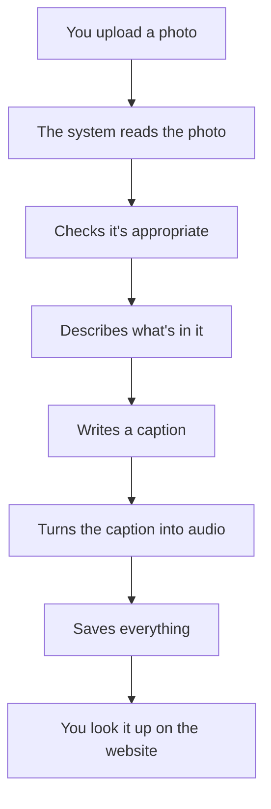
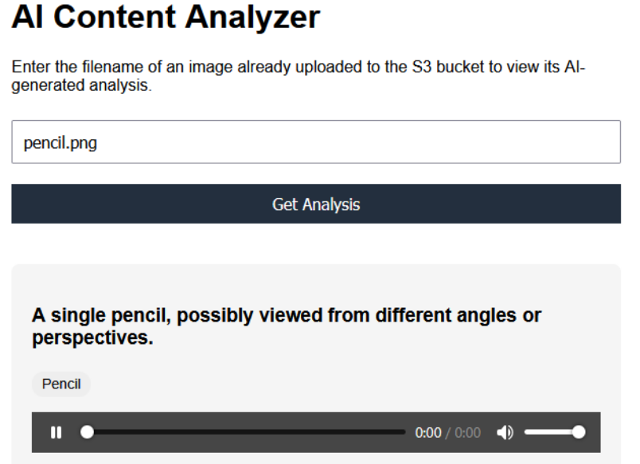
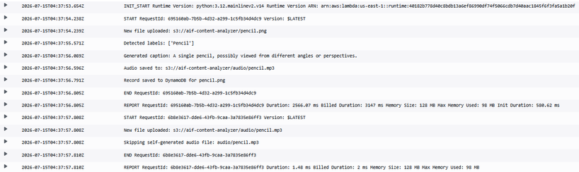
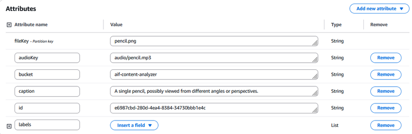

# aws-ai-content-analyzer
A serverless AWS pipeline that analyzes uploaded images using Rekognition, Bedrock for AI generated captions, and Polly for text to speech, entirely within AWS.

Built after completing the AWS Certified AI Practitioner (AIF-C01) certification, the main goal of this project is to apply exam concepts into practice, such as responsible AI, generative AI fundamentals, security and governance.

## What it does

1. An image is uploaded to an S3 bucket.
2. This triggers a Lambda function that:
   - Runs Rekognition content moderation as a safety gate before any further processing.
   - Runs Rekognition label detection to identify what's in the image.
   - Sends those labels to Amazon Bedrock (Nova Lite) to generate a natural-language caption — with prompt constraints specifically designed to prevent the model from inventing objects or context not actually present in the labels.
   - Converts the caption to speech with Amazon Polly.
   - Stores the full result (labels, caption, audio location) in DynamoDB.
3. A separate Lambda function, exposed through API Gateway, serves these results as JSON.
4. A minimal static frontend, hosted on S3, lets you look up a processed image by filename and see/hear the result.

## Architecture



*Under the hood: S3 (storage) → Lambda (orchestration) → Rekognition (image understanding + moderation) → Bedrock (caption generation) → Polly (text-to-speech) → DynamoDB (storage) → API Gateway (retrieval) → S3 (frontend).*

## Proof it works

**Frontend result**


**CloudWatch logs showing the full pipeline executing end-to-end**
```
New file uploaded: s3://aif-content-analyzer/pencil.png
Detected labels: ['Pencil']
Generated caption: A single pencil, resting against a plain background.
Audio saved to: s3://aif-content-analyzer/audio/pencil.mp3
Record saved to DynamoDB for pencil.png
...
New file uploaded: s3://aif-content-analyzer/audio/pencil.mp3
Skipping self-generated audio file: audio/pencil.mp3
```


**DynamoDB record**


## Tech stack

| Service | Role |
|---|---|
| S3 | Image storage + static website hosting |
| Lambda | Orchestrates the analysis pipeline and serves API results |
| Rekognition | Content moderation + label detection |
| Bedrock (Amazon Nova Lite) | Generates natural-language captions |
| Polly | Converts captions to speech |
| DynamoDB | Stores processed results |
| API Gateway | Exposes results via a REST endpoint |
| IAM | Per-function execution roles |
| CloudWatch | Logging and monitoring |
